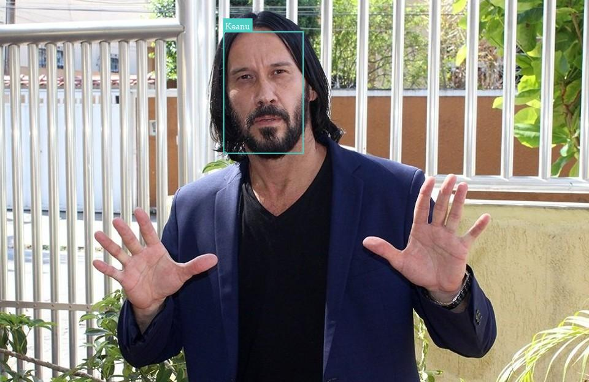

# Face Recognition



> This project uses [this fork](https://github.com/vladmandic/face-api) of [FaceApi.js](https://github.com/justadudewhohacks/face-api.js/) to try to identify some person in a bunch of pictures <br> Person on picture: [Marcos Jeeves](https://www.instagram.com/marcosjeeves/?hl=pt-br)


## 💻 Requirements

* [Node.Js](https://nodejs.org/en/)

* [Yarn (Opcional)](https://yarnpkg.com/)


## 🚀 Installing face_recognition

First, clone this repository and open it in a terminal.
Then, run this command to download all dependencies

Yarn:
```bash
yarn install
```

If you didn't install yarn, you can still run this project with npm, node default package manager

```bash
npm install
```


## ☕ Using face_recognition


After downloading all dependencies, follow these steps:
* change all images on src/referenceImages with pictures of the person you want to identity as references.
 simply run this command
* change all images on src/imagesQuery with pictures where you want to try to identify your reference
* delete all images inside src/output

After you're done, simply run this command:

Yarn:
```bash
yarn start
```

npm: 
```bash
npm start
```

After a few minutes the results will be located at src/output


